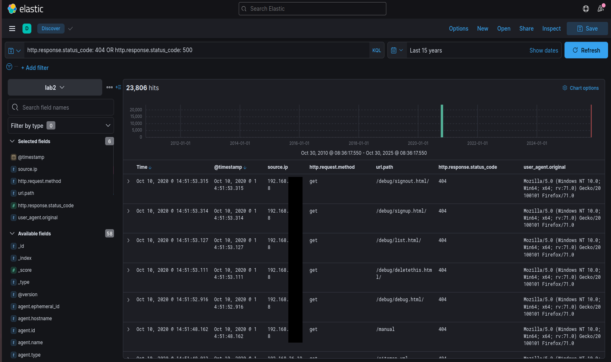
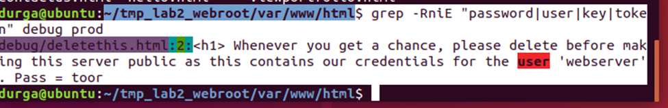
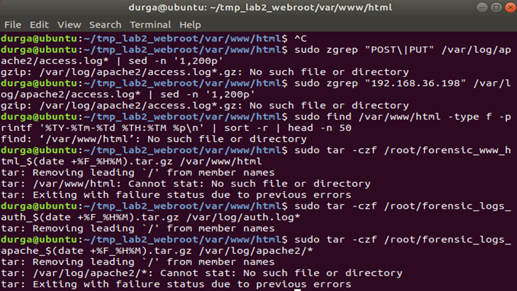

# Vulnerable Web Server Traffic Analysis Lab - Network Forensics & Incident Investigation

A structured incident investigation analyzing malicious network traffic targeting a vulnerable web server using Kibana and Packetbeat logs - reconstructing the attack chain, identifying credential exposure as the root cause, and producing remediation recommendations.

---

## Scenario

A web server was compromised. The investigation used ELK Stack network telemetry and forensic review of the web root directory archive to determine how the attacker got in, what they did, and how to prevent recurrence.

---

## Tools & Environment

| Tool | Purpose |
|---|---|
| Kibana (ELK Stack) | Network traffic analysis and log correlation |
| Packetbeat | Network telemetry capture |
| Linux log files | auth.log, Apache logs |
| Lab2webdirectory.tar.gz | Forensic web root directory archive |

---

## Investigation Methodology

### 1. Network Analysis
- Applied Kibana filters to review all traffic to and from the web server
- Identified suspicious source IPs and HTTP request patterns
- Examined SSH connection metadata alongside HTTP activity



### 2. Timeline Reconstruction
- Correlated HTTP requests and SSH sessions by timestamp
- Determined the attack window and full sequence of events

### 3. File System Analysis
- Extracted and reviewed the web root directory archive
- Searched for webshells, base64-encoded payloads, and suspicious PHP execution functions
- Identified exposed plaintext credentials in a debug file left in production



### 4. Web Root Directory Review
- No webshells or malicious scripts found in the directory structure
- Confirmed attack was credential-based, not code injection



### 5. Log Correlation
- Cross-referenced network logs, extracted web files, and system logs
- Determined full compromise path from initial recon through SSH access

---

## Attack Timeline

| Time (UTC) | Source IP | Event | Observation |
|---|---|---|---|
| 14:45:09 | 192.168.xx.xx | GET /admin.html | Initial recon attempt |
| 14:48:18 | 192.168.xx.xxx | GET /cgi-bin/pub/pki?cmd=serverInfo (404) | CGI endpoint probing |
| 14:49:31 | 192.168.xx.xxx | GET /apex/listenerConfigure | Continued scanning |
| 14:50:05 | 192.168.xx.xxx | GET /debug/deletethis.html | Credential exposure accessed |
| 14:51 - 14:53 | 192.168.xx.xxx | HTTP + SSH (port 80/22) | Attack window - SSH session established |

---

## Root Cause - Exposed Debug File

The file `/debug/deletethis.html` was left in the production web root and was publicly accessible. It contained hardcoded plaintext SSH credentials:

```
Username: webserver
Password: toor
```

This file was clearly intended for removal before deployment. Its presence allowed the attacker to authenticate directly via SSH without any exploitation of code vulnerabilities.

**This was not a sophisticated attack.** It was a deployment hygiene failure - a development artifact left in production that handed valid credentials to anyone who scanned for it.

---

## Attack Chain

```
1. Reconnaissance
   Scanned for admin pages, CGI endpoints, and debug directories

2. Credential Discovery
   Accessed /debug/deletethis.html
   Retrieved plaintext SSH credentials (webserver:toor)

3. Initial Access
   SSH login to server on port 22 using discovered credentials

4. Post-Access Activity
   Website file modification via SSH (defacement observed)

5. No Persistence Established
   No webshells or backdoors found - attacker did not attempt to maintain access
```

---

## Indicators of Compromise (IOCs)

| Type | Indicator |
|---|---|
| Attacker IP | 192.168.xx.xxx |
| Recon IP | 192.168.xx.xxx |
| Target IP | 192.168.xx.xxx |
| Suspicious URLs | /admin.html, /cgi-bin/pub/pki, /apex/listenerConfigure, /debug/deletethis.html |
| Leaked Credentials | webserver : toor |
| Affected Ports | 80 (HTTP), 22 (SSH) |

---

## MITRE ATT&CK Mapping

| Technique | ID | Evidence |
|---|---|---|
| Active Scanning | T1595 | HTTP probing of admin, CGI, and debug paths |
| Credentials in Files | T1552.001 | Plaintext credentials in /debug/deletethis.html |
| Valid Accounts | T1078 | SSH login using harvested credentials |
| Exploit Public-Facing Application | T1190 | Web server exposed debug artifacts publicly |
| Defacement | T1491 | Website files modified post-access |

---

## Remediation

### Immediate Actions

| Action | Purpose |
|---|---|
| Delete /debug directory | Remove exposed credentials from production |
| Rotate webserver account password | Invalidate leaked credentials immediately |
| Restrict SSH to key-based authentication | Eliminate password-based SSH access |
| Isolate and reimage server | Ensure clean system state post-compromise |

### Long-Term Improvements

- Enforce strict separation between development and production environments
- Implement pre-deployment checklists to scan for debug files, hardcoded credentials, and config artifacts
- Enable a Web Application Firewall (WAF) and IDS for the web server
- Apply least privilege to all service accounts - webserver account should not have interactive SSH access
- Centralize logging via SIEM to detect reconnaissance patterns before credentials are accessed

---

## Key Takeaway

The attacker never needed to exploit a single vulnerability. A debug file that should have been deleted before deployment handed them valid SSH credentials. This investigation is a strong example of how organizational and process failures - not just technical ones - lead to compromises. Secure configuration management and pre-deployment hygiene checks would have prevented this entirely.

---

## Skills Demonstrated

`Network Traffic Analysis` `SIEM Investigation (Kibana/ELK)` `Packetbeat Log Analysis` `Web Application Attack Analysis` `Attack Chain Reconstruction` `IOC Identification` `MITRE ATT&CK Mapping` `Forensic File Analysis` `Incident Response`

---

> This investigation was performed in a controlled lab environment using simulated network telemetry. Developed as part of academic coursework and expanded for cybersecurity portfolio demonstration.

**Author:** Durga Sai Sri Ramireddy | MS Cybersecurity, University of Houston  
[](https://linkedin.com/in/durga-ramireddy)
[](https://github.com/DurgaRamireddy)
